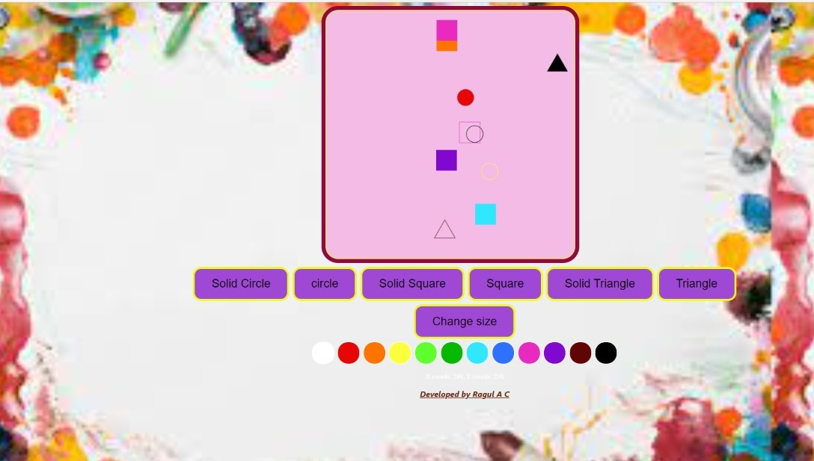

# Web Page for Paint Application

## AIM:

To design a static website for Paint Application using HTML5 canvas.

## DESIGN STEPS:

### Step 1:

Requirement collection.

### Step 2:

Creating the layout using HTML,CSS and canvas.

### Step 3:

Write javascript to capture move events.

### Step 4:

Perform the drawing operation based on the user input.

### Step 5:

Validate the layout in various browsers.

### Step 6:

Validate the HTML code.

### Step 6:

Publish the website in the given URL.

## PROGRAM :
```
<!DOCTYPE html>
<html lang="en">
  <head>
    <meta charset="UTF-8" />
    <meta http-equiv="X-UA-Compatible" content="IE=edge" />
    <meta name="viewport" content="width=device-width, initial-scale=1.0" />
    <title>Paint Application</title>
    <link rel="icon" href="./img/logo.png" type="image/x-icon" />
    <style>

        #content{
            padding-left: 800px;
           
        }
        #myCanvas{
          background-color: rgb(243, 187, 229);
          box-shadow: inset 0 0 7px rgb(231, 255, 17); 
          border-radius: 40px;
          border: 10px solid rgb(143, 9, 60);
        }
        #buttonstyle{
          background-color:rgb(160, 72, 214);
          border: 5px solid #ecfc13;
          border-radius: 20px;
          color: black;
          padding: 20px 40px;
          text-align: center;
          display: inline-block;
          font-size: 28px;
          margin: 4px 2px;
          cursor: pointer;
        }
        #buttonstyle:hover{
            background-color:#f1b1fd36;
            transition: 0.5s;
        }
        #bgimg{
            background-image:url("./a4.jpg");
            background-size: 500mm;
        }
        #shooky{
            border: 2px solid #ffffff;
            border-radius: 25px;
            padding: 25px 25px;
            text-align: center;
            display: inline-block;
            font-size: 28px;
            margin: 4px 2px;
            cursor: pointer;
        }
        #shooky:hover{
            opacity: 20%;
            transition: 0.21s;
        }
        </style>
  </head>
  <body id="bgimg">
    <div id="content">
      <canvas id="myCanvas" width="600" height="800" onclick="showCoords(event)"></canvas></div>
      <center>
      <button onclick="shape=1" id="buttonstyle" >Solid Circle</button>
      <button onclick="shape=2" id="buttonstyle">circle</button>
      <button onclick="shape=3" id="buttonstyle">Solid Square</button>
      <button onclick="shape=4" id="buttonstyle">Square</button>
      <button onclick="shape=5" id="buttonstyle">Solid Triangle</button>
      <button onclick="shape=6" id="buttonstyle">Triangle</button>
      <br>
      <button onclick="size()" id="buttonstyle" >Change size</button></center>
      <center>
      <button onclick="change_color(this)" id="shooky" style="background: white;"></button>
      <button onclick="change_color(this)" id="shooky" style="background: rgb(231, 5, 5);"></button>
      <button onclick="change_color(this)" id="shooky" style="background: rgb(255, 115, 1);"></button>
      <button onclick="change_color(this)" id="shooky" style="background: rgb(252, 255, 60);"></button>
      <button onclick="change_color(this)" id="shooky" style="background: rgb(94, 255, 45);"></button>
      <button onclick="change_color(this)" id="shooky" style="background: rgb(7, 184, 1);"></button>
      <button onclick="change_color(this)" id="shooky" style="background: rgb(49, 231, 255);"></button>
      <button onclick="change_color(this)" id="shooky" style="background: rgb(46, 112, 255);"></button>
      <button onclick="change_color(this)" id="shooky" style="background: rgb(233, 42, 192);"></button>
      <button onclick="change_color(this)" id="shooky" style="background: rgb(128, 8, 207);"></button>
      <button onclick="change_color(this)" id="shooky" style="background: rgb(97, 4, 4);"></button>
      <button onclick="change_color(this)" id="shooky" style="background: rgb(0, 0, 0);"></button>
      </center>

      <script>


        const canvas = document.getElementById("myCanvas");
        const ctx = canvas.getContext("2d");
        ctx.fillStyle = "#FF0000";
        canvas.height = canvas.width;
        ctx.transform(1, 0, 0, -1, 0, canvas.height);
        let xMax = canvas.height;
        let yMax = canvas.width;
        let csize= 20;
        let sqsize= 50;
        let tsize=50;
        let tata="black";
        function size(){   
          if (shape==1 ||shape==2){
            let c= prompt("Please enter size of circle", "ex:100,50");
            csize=c;
          } 
          if (shape==3 ||shape==4){
            let s = prompt("Please enter size of square", "ex:100,20");
            sqsize=s;
          }
          if (shape==5 || shape==6){
            let t= prompt("Please enter size of triangle","ex:50,84");
            tsize=t;
          }
        }
        function change_color(element){
          tata=element.style.background;
        }
        function showCoords(event)
        {
          var x = event.clientX-545;
          var y = yMax-event.clientY;
          var coords = "X coords: " + x + ", Y coords: " + y;
          document.getElementById("demo").innerHTML = coords;
    
          if (shape==1){
            ctx.beginPath();
            ctx.arc(x, y, csize, 0, 2 * Math.PI);
            ctx.fillStyle=tata;
            ctx.fill();
          }
          if (shape==2){
            ctx.beginPath();
            ctx.arc(x, y, csize, 0, 2 * Math.PI);
            ctx.strokeStyle=tata;
            ctx.stroke();
          }
          if (shape==3){
            ctx.beginPath();
            ctx.rect(x-(sqsize/2),y-(sqsize/2), sqsize,sqsize);
            ctx.fillStyle=tata;
            ctx.fill();
          }
          if (shape==4){
            ctx.beginPath();
            ctx.rect(x-(sqsize/2),y-(sqsize/2), sqsize,sqsize);
            ctx.strokeStyle=tata;
            ctx.stroke();
          }
          if (shape==6){
            ctx.beginPath();
            ctx.moveTo(x, y);
            ctx.lineTo(x-(tsize/2),y-(tsize*0.86602));
            ctx.lineTo(x+(tsize/2),y-(tsize*0.86602));
            ctx.lineTo(x,y)
            ctx.strokeStyle=tata;
            ctx.stroke();
          }
          if (shape==5){
            ctx.beginPath();
            ctx.moveTo(x, y);
            ctx.lineTo(x-(tsize/2),y-(tsize*0.86602));
            ctx.lineTo(x+(tsize/2),y-(tsize*0.86602));
            ctx.fillStyle=tata;
            ctx.fill();
          }    
        }
      </script>
    <center><p id="demo" style="color: white;"></p></center>
    <p 
    style="font-family: -apple-system, BlinkMacSystemFont, 'Segoe UI', Roboto, Oxygen, Ubuntu, Cantarell, 'Open Sans', 'Helvetica Neue', cursive; 
    text-align: center;
    color:rgb(107, 35, 13);
    font-weight: bold;
    font-size: larger;"> <u><i>Developed by Ragul A C</i></u></p>
  </body>
</html>
```

## OUTPUT:



## Result:

Thus a website is designed and validated for paint application using HTML5 canvas.
